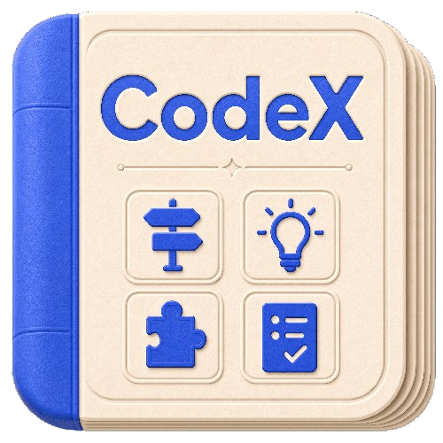

# Codex Handbook

<p align="center">
  
</p>

<p align="center">
  
</p>

<p align="center"><strong>Manual sistemático y base de conocimiento práctica para Codex</strong></p>

<p align="center">
  <a href="./README.md">简体中文</a>
  ·
  <a href="./README.en.md">English</a>
  ·
  <a href="./README.zh-TW.md">繁體中文</a>
  ·
  <a href="./README.fr.md">Français</a>
  ·
  <a href="./README.ja.md">日本語</a>
  ·
  <a href="./README.ko.md">한국어</a>
  ·
  <a href="./README.es.md">Español</a>
  ·
  <a href="./README.de.md">Deutsch</a>
  ·
  <a href="./README.pt.md">Português</a>
  ·
  <a href="./README.vi.md">Tiếng Việt</a>
</p>

<p align="center">
  <a href="https://codexhandbook.com/es/">Leer en línea</a>
  ·
  <a href="./src/content/docs/guide/index.md">Guía para principiantes</a>
  ·
  <a href="./docs/planning/content-architecture.md">Arquitectura del contenido</a>
  ·
  <a href="./ROADMAP.md">Hoja de ruta</a>
  ·
  <a href="./examples/README.md">Ejemplos</a>
</p>

<p align="center">
  <a href="https://codexhandbook.com/"></a>
  <a href="https://codexhandbook.com/es/"></a>
  <a href="https://starlight.astro.build/"></a>
</p>

> Desde tu primera vez abriendo Codex hasta usarlo en proyectos reales, flujos de trabajo y acumulación de conocimiento a largo plazo.  
> Esto no es una colección dispersa de trucos, sino un manual práctico sistemático organizado en torno a `Guía / Prompts / Skills / Casos`.

## Qué es esto

**Codex Handbook** es una base de conocimiento sistemática para aprender y practicar con Codex. No intenta responder la pregunta amplia de «¿qué puede hacer Codex?». Se centra en tres preguntas más prácticas:

- ¿Por dónde empezar cuando conoces Codex por primera vez?
- ¿Cómo describir tareas, organizar el contexto y verificar resultados al usar Codex en proyectos reales?
- Después de una colaboración exitosa, ¿cómo convertir esa experiencia en prompts, Skills, reglas, casos y activos de equipo?

Si acabas de empezar con Codex, este repositorio y sitio web son tu primer punto de partida.

## Empieza aquí

### 1. Leer en línea

La entrada principal de lectura es [codexhandbook.com/es](https://codexhandbook.com/es/).  
Para navegación completa, búsqueda, organización de capítulos y actualizaciones continuas, prefiere el sitio web.

### 2. Primera ruta de lectura para principiantes

Recomendamos empezar en este orden:

1. [Guía — inicio](./src/content/docs/guide/index.md)
2. [Contexto y archivos](./src/content/docs/guide/context-and-files.md)
3. [Prompts](./src/content/docs/prompts/index.md)
4. [Skills](./src/content/docs/skills/index.md)
5. [Casos](./src/content/docs/cases/index.md)

Esta ruta es para quienes son nuevos en Codex: ayuda a construir una base sólida antes de la práctica.

## Qué aprenderás

### Guía

Entender cómo elegir el punto de entrada de Codex, seguir rutas de uso básicas, organizar el contexto, respetar los límites de permisos y verificar resultados.

### Prompts

Aprender a describir tareas con claridad, definir restricciones, objetivos, entradas y criterios de aceptación para que Codex produzca resultados verificables.

### Skills

Aprender a diseñar, usar, mantener y gobernar Skills: convertir una colaboración exitosa en una capacidad reutilizable a largo plazo.

### Casos prácticos

Comprender flujos de trabajo de extremo a extremo mediante tareas reales: leer código, corregir bugs, escribir documentación, investigar, automatizar y colaborar en entregas.

## Para quién es

- Principiantes que descubren Codex por primera vez
- Desarrolladores que quieren usar Codex en proyectos reales
- Equipos que necesitan capturar prompts, reglas, plantillas y casos
- Profesionales del conocimiento que usan Codex para escribir, investigar, documentar y presentar

## Enlaces rápidos

| Enlace | Uso |
| --- | --- |
| [Leer en línea](https://codexhandbook.com/es/) | Explorar el manual completo en el sitio |
| [Guía](./src/content/docs/guide/index.md) | Entender las rutas de uso de Codex desde cero |
| [Prompts](./src/content/docs/prompts/index.md) | Aprender a describir tareas y límites con claridad |
| [Skills](./src/content/docs/skills/index.md) | Convertir la experiencia en capacidades reutilizables |
| [Casos](./src/content/docs/cases/index.md) | Ver flujos de extremo a extremo con tareas reales |
| [Ejemplos](./examples/README.md) | Reutilizar prompts y activos de ejemplo |
| [Arquitectura del contenido](./docs/planning/content-architecture.md) | Entender el diseño de información del sitio |
| [Esquema de capítulos](./docs/planning/chapter-outline.md) | Ver la cobertura de temas |
| [Hoja de ruta](./ROADMAP.md) | Planes y dirección del proyecto |

## Estructura del contenido

```text
Codex Handbook
├── src/content/docs/guide/      # Guía, clientes, permisos, verificación
├── src/content/docs/prompts/    # Métodos de prompts y expresión de tareas
├── src/content/docs/skills/     # Diseño, uso y gobernanza de Skills
├── src/content/docs/cases/      # Casos de tareas reales
├── examples/                    # Prompts copiables y ejemplos extendidos
├── docs/planning/               # Planificación y mantenimiento del contenido
└── ROADMAP.md                   # Hoja de ruta y fases del proyecto
```

## Desarrollo local

Este proyecto usa [Astro](https://astro.build/) + [Starlight](https://starlight.astro.build/) para el sitio de documentación. El contenido principal está en `src/content/docs/`.

Requisitos:

- Node.js `>=22.12.0`
- `pnpm`

Iniciar el entorno de desarrollo:

```bash
pnpm install
pnpm dev
```

Construir el sitio estático:

```bash
pnpm build
```

## Principios

- **Oficial primero**: para capacidades del producto, reglas y límites, prefiere fuentes oficiales.
- **Accesible para principiantes**: sin asumir experiencia en terminal, Git, Agent o automatización.
- **Orientado a tareas reales**: flujos reutilizables, casos y plantillas — no acumulación de conceptos abstractos.
- **Límites de seguridad claros**: permisos, escritura de archivos, red, automatización y extensiones deben explicar los riesgos.
- **Captura continua**: animar a convertir una tarea exitosa en prompts, Skills, reglas, casos y activos de equipo.

## Contribuir

Aceptamos:

- Reescrituras de tutoriales accesibles para principiantes
- Casos reales reproducibles
- Prompts de calidad, plantillas de Skills, muestras de configuración y materiales de casos
- Verificación de hechos y corrección de contenido obsoleto
- Contenido en otros idiomas (e.g. English, 简体中文, 繁體中文)

Para contribuir contenido, empieza por:

- [Guía de ejemplos](./examples/README.md)
- [Arquitectura del contenido](./docs/planning/content-architecture.md)
- [Esquema de capítulos](./docs/planning/chapter-outline.md)

## Aviso legal

Este proyecto es un manual práctico de Codex mantenido por la comunidad — no un proyecto oficial de OpenAI. Para detalles sensibles al tiempo (funciones, precios, disponibilidad, políticas de seguridad y detalles del producto), consulta fuentes oficiales.
