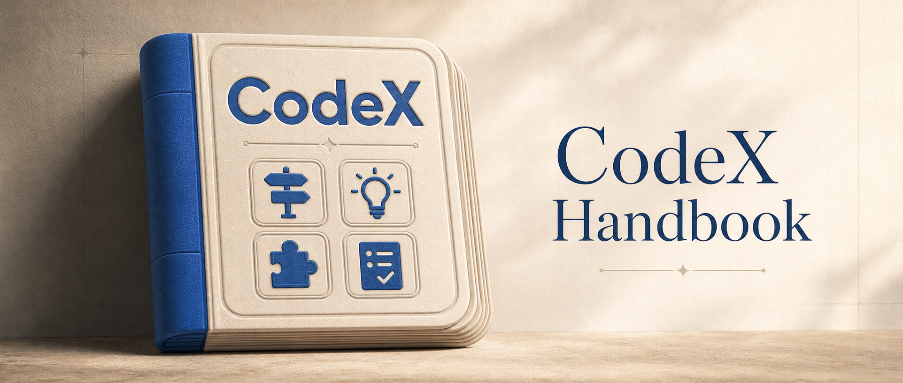

# Codex Handbook

<p align="center">
  
</p>

<p align="center">
  
</p>

<p align="center"><strong>Codex 체계적 핸드북 및 실습 지식 베이스</strong></p>

<p align="center">
  <a href="./README.md">简体中文</a>
  ·
  <a href="./README.en.md">English</a>
  ·
  <a href="./README.zh-TW.md">繁體中文</a>
  ·
  <a href="./README.fr.md">Français</a>
  ·
  <a href="./README.ja.md">日本語</a>
  ·
  <a href="./README.ko.md">한국어</a>
  ·
  <a href="./README.es.md">Español</a>
  ·
  <a href="./README.de.md">Deutsch</a>
  ·
  <a href="./README.pt.md">Português</a>
  ·
  <a href="./README.vi.md">Tiếng Việt</a>
</p>

<p align="center">
  <a href="https://codexhandbook.com/ko/">온라인 읽기</a>
  ·
  <a href="./src/content/docs/guide/index.md">초보자 가이드</a>
  ·
  <a href="./docs/planning/content-architecture.md">콘텐츠 구조</a>
  ·
  <a href="./ROADMAP.md">로드맵</a>
  ·
  <a href="./examples/README.md">예제 라이브러리</a>
</p>

<p align="center">
  <a href="https://codexhandbook.com/"></a>
  <a href="https://codexhandbook.com/ko/"></a>
  <a href="https://starlight.astro.build/"></a>
</p>

> Codex를 처음 열었을 때부터 실제 프로젝트, 워크플로, 장기적인 지식 축적까지.  
> 이것은 흩어진 팁 모음이 아니라 `가이드 / 프롬프트 / Skills / 실전 사례`로 구성된 체계적인 실습 핸드북입니다.

## 이것은 무엇인가

**Codex Handbook**은 Codex 학습과 실습을 위한 체계적인 지식 베이스입니다. "Codex로 무엇을 할 수 있는가?"라는 광범위한 질문이 아니라, 다음 세 가지 실질적인 질문에 답합니다:

- Codex를 처음 접할 때 어디서 시작해야 하는가?
- 실제 프로젝트에 Codex를 쓸 때 작업을 어떻게 설명하고, 컨텍스트를 어떻게 구성하고, 결과를 어떻게 검증해야 하는가?
- 한 번 성공한 협업 이후, 그 경험을 프롬프트, Skills, 규칙, 사례, 팀 자산으로 어떻게 축적하는가?

Codex를 처음 알게 된다면, 이 저장소와 웹사이트가 첫 출발점입니다.

## 여기서 시작

### 1. 온라인 읽기

공식 읽기 진입점은 [codexhandbook.com/ko](https://codexhandbook.com/ko/)입니다.  
전체 내비게이션, 검색, 챕터 구성, 지속적인 업데이트를 원한다면 웹사이트를 우선 이용하세요.

### 2. 초보자를 위한 첫 읽기 경로

다음 순서로 시작하는 것을 권장합니다:

1. [Guide 홈](./src/content/docs/guide/index.md)
2. [컨텍스트와 파일](./src/content/docs/guide/context-and-files.md)
3. [Prompts](./src/content/docs/prompts/index.md)
4. [Skills](./src/content/docs/skills/index.md)
5. [Cases](./src/content/docs/cases/index.md)

Codex를 처음 접하는 사람에게 적합한 경로로, 실전에 들어가기 전에 안정적인 기초를 쌓을 수 있습니다.

## 여기서 배울 수 있는 것

### 가이드

Codex 진입점 선택, 기본 사용 경로, 컨텍스트 구성, 권한 경계, 결과 검증 방법을 이해합니다.

### 프롬프트

작업을 명확히 전달하고, 제약·목표·입력·수락 기준을 정의하여 Codex가 검증 가능한 결과를 안정적으로 내는 방법을 학습합니다.

### Skills

Skills 설계·사용·유지·거버넌스를 학습하고, 한 번의 성공한 협업을 장기적으로 재사용 가능한 역량으로 전환합니다.

### 실전 사례

코드 읽기, 버그 수정, 문서 작성, 조사, 자동화, 납품 협업 등 실제 작업을 통해 엔드투엔드 워크플로를 이해합니다.

## 대상

- Codex를 처음 알게 된 초보자
- 실제 프로젝트에 Codex를 쓰고 싶은 개발자
- 프롬프트, 규칙, 템플릿, 사례를 축적해야 하는 팀
- 글쓰기, 조사, 문서, 프레젠테이션에 Codex를 쓰려는 지식 노동자

## 빠른 링크

| 링크 | 용도 |
| --- | --- |
| [온라인 읽기](https://codexhandbook.com/ko/) | 웹사이트에서 전체 핸드북 탐색 |
| [Guide](./src/content/docs/guide/index.md) | Codex 사용 경로를 처음부터 이해 |
| [Prompts](./src/content/docs/prompts/index.md) | 작업과 경계를 명확히 설명하는 방법 학습 |
| [Skills](./src/content/docs/skills/index.md) | 경험을 재사용 가능한 역량으로 축적 |
| [Cases](./src/content/docs/cases/index.md) | 실제 작업으로 엔드투엔드 워크플로 이해 |
| [Examples](./examples/README.md) | 프롬프트와 예제 자산을 직접 재사용 |
| [콘텐츠 구조](./docs/planning/content-architecture.md) | 사이트 정보 설계를 빠르게 이해 |
| [챕터 개요](./docs/planning/chapter-outline.md) | 주제 범위 확인 |
| [로드맵](./ROADMAP.md) | 프로젝트 계획과 향후 방향 |

## 콘텐츠 구조

```text
Codex Handbook
├── src/content/docs/guide/      # 입문 가이드, 클라이언트, 권한, 검증
├── src/content/docs/prompts/    # 프롬프트 방법과 작업 표현
├── src/content/docs/skills/     # Skills 설계, 사용, 거버넌스
├── src/content/docs/cases/      # 실제 작업 사례
├── examples/                    # 복사 가능한 프롬프트와 확장 예제
├── docs/planning/               # 콘텐츠 계획 및 유지보수 자료
└── ROADMAP.md                   # 프로젝트 로드맵과 단계
```

## 로컬 개발

이 프로젝트는 [Astro](https://astro.build/) + [Starlight](https://starlight.astro.build/)로 문서 사이트를 구축합니다. 본문은 `src/content/docs/`에 있습니다.

환경 요구사항:

- Node.js `>=22.12.0`
- `pnpm`

개발 환경 시작:

```bash
pnpm install
pnpm dev
```

정적 사이트 빌드:

```bash
pnpm build
```

## 프로젝트 원칙

- **공식 우선**: 제품 기능, 규칙, 경계에 관해서는 공식 자료를 우선합니다.
- **초보자 친화**: 터미널, Git, Agent, 자동화 배경을 가정하지 않습니다.
- **실제 작업 지향**: 추상 개념의 나열이 아니라 재사용 가능한 워크플로, 사례, 템플릿을 강조합니다.
- **안전 경계 명확**: 권한, 파일 쓰기, 네트워크, 자동화, 확장 기능의 위험을 명확히 설명합니다.
- **지속적 축적**: 한 번 성공한 작업을 프롬프트, Skills, 규칙, 사례, 팀 자산으로 전환하도록 권장합니다.

## 참여하기

다음을 환영합니다:

- 초보자 친화적인 튜토리얼 개정
- 재현 가능한 실제 사례
- 고품질 프롬프트, Skill 템플릿, 설정 샘플, 사례 자료
- 사실 확인 및 만료된 내용 수정
- 다른 언어 버전의 콘텐츠 (예: English, 简体中文, 繁體中文)

콘텐츠 참여를 원한다면 먼저 다음을 확인하세요:

- [예제 라이브러리 설명](./examples/README.md)
- [콘텐츠 구조](./docs/planning/content-architecture.md)
- [챕터 개요](./docs/planning/chapter-outline.md)

## 고지

본 프로젝트는 커뮤니티가 유지하는 Codex 실습 핸드북이며 OpenAI 공식 프로젝트가 아닙니다. 기능, 가격, 가용성, 보안 정책, 제품 세부사항 등 시간에 민감한 정보는 공식 자료를 참조하세요.
