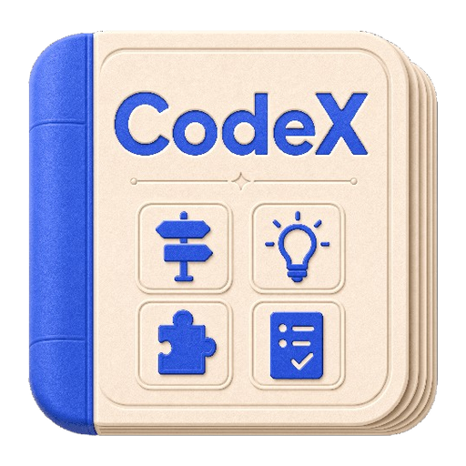

# Codex Handbook

<p align="center">
  
</p>

<p align="center">
  
</p>

<p align="center"><strong>Manual sistemático e base de conhecimento prática para Codex</strong></p>

<p align="center">
  <a href="./README.md">简体中文</a>
  ·
  <a href="./README.en.md">English</a>
  ·
  <a href="./README.zh-TW.md">繁體中文</a>
  ·
  <a href="./README.fr.md">Français</a>
  ·
  <a href="./README.ja.md">日本語</a>
  ·
  <a href="./README.ko.md">한국어</a>
  ·
  <a href="./README.es.md">Español</a>
  ·
  <a href="./README.de.md">Deutsch</a>
  ·
  <a href="./README.pt.md">Português</a>
  ·
  <a href="./README.vi.md">Tiếng Việt</a>
</p>

<p align="center">
  <a href="https://codexhandbook.com/pt/">Ler online</a>
  ·
  <a href="./src/content/docs/guide/index.md">Guia para iniciantes</a>
  ·
  <a href="./docs/planning/content-architecture.md">Arquitetura de conteúdo</a>
  ·
  <a href="./ROADMAP.md">Roadmap</a>
  ·
  <a href="./examples/README.md">Exemplos</a>
</p>

<p align="center">
  <a href="https://codexhandbook.com/"></a>
  <a href="https://codexhandbook.com/pt/"></a>
  <a href="https://starlight.astro.build/"></a>
</p>

> Da primeira vez que você abre o Codex até usá-lo em projetos reais, fluxos de trabalho e acumulação de conhecimento a longo prazo.  
> Isso não é uma coleção dispersa de truques — é um manual prático sistemático organizado em torno de `Guia / Prompts / Skills / Casos`.

## O que é isto

**Codex Handbook** é uma base de conhecimento sistemática para aprender e praticar com Codex. Não tenta responder à pergunta ampla «o que o Codex pode fazer?». Foca em três questões mais práticas:

- Por onde começar ao conhecer o Codex?
- Como descrever tarefas, organizar contexto e verificar resultados ao usar Codex em projetos reais?
- Após uma colaboração bem-sucedida, como transformar essa experiência em prompts, Skills, regras, casos e ativos de equipe?

Se você está começando com Codex, este repositório e site são seu primeiro ponto de partida.

## Comece aqui

### 1. Ler online

A entrada principal de leitura é [codexhandbook.com/pt](https://codexhandbook.com/pt/).  
Para navegação completa, busca, organização de capítulos e atualizações contínuas, prefira o site.

### 2. Primeiro caminho de leitura para iniciantes

Recomendamos começar nesta ordem:

1. [Guia — início](./src/content/docs/guide/index.md)
2. [Contexto e arquivos](./src/content/docs/guide/context-and-files.md)
3. [Prompts](./src/content/docs/prompts/index.md)
4. [Skills](./src/content/docs/skills/index.md)
5. [Casos](./src/content/docs/cases/index.md)

Este caminho é para quem é novo no Codex — ajuda a construir uma base sólida antes da prática.

## O que você vai aprender

### Guia

Entender como escolher o ponto de entrada do Codex, seguir caminhos de uso básicos, organizar contexto, respeitar limites de permissão e verificar resultados.

### Prompts

Aprender a descrever tarefas com clareza, definir restrições, objetivos, entradas e critérios de aceitação para que o Codex produza resultados verificáveis.

### Skills

Aprender a projetar, usar, manter e governar Skills — transformando uma colaboração bem-sucedida em capacidade reutilizável a longo prazo.

### Casos práticos

Compreender fluxos de trabalho de ponta a ponta por meio de tarefas reais: ler código, corrigir bugs, escrever documentação, pesquisar, automatizar e colaborar em entregas.

## Para quem é

- Iniciantes descobrindo o Codex por primeira vez
- Desenvolvedores que querem usar Codex em projetos reais
- Equipes que precisam capturar prompts, regras, modelos e casos
- Profissionais de conhecimento usando Codex para escrita, pesquisa, documentação e apresentações

## Links rápidos

| Link | Uso |
| --- | --- |
| [Ler online](https://codexhandbook.com/pt/) | Navegar o manual completo no site |
| [Guia](./src/content/docs/guide/index.md) | Entender caminhos de uso do Codex do zero |
| [Prompts](./src/content/docs/prompts/index.md) | Aprender a descrever tarefas e limites com clareza |
| [Skills](./src/content/docs/skills/index.md) | Transformar experiência em capacidades reutilizáveis |
| [Casos](./src/content/docs/cases/index.md) | Ver fluxos de ponta a ponta com tarefas reais |
| [Exemplos](./examples/README.md) | Reutilizar prompts e ativos de exemplo |
| [Arquitetura de conteúdo](./docs/planning/content-architecture.md) | Entender o design de informação do site |
| [Esboço de capítulos](./docs/planning/chapter-outline.md) | Ver cobertura de tópicos |
| [Roadmap](./ROADMAP.md) | Planos e direção do projeto |

## Estrutura do conteúdo

```text
Codex Handbook
├── src/content/docs/guide/      # Guia, clientes, permissões, verificação
├── src/content/docs/prompts/    # Métodos de prompts e expressão de tarefas
├── src/content/docs/skills/     # Design, uso e governança de Skills
├── src/content/docs/cases/      # Casos de tarefas reais
├── examples/                    # Prompts copiáveis e exemplos estendidos
├── docs/planning/               # Planejamento e manutenção de conteúdo
└── ROADMAP.md                   # Roadmap e fases do projeto
```

## Desenvolvimento local

Este projeto usa [Astro](https://astro.build/) + [Starlight](https://starlight.astro.build/) para o site de documentação. O conteúdo principal está em `src/content/docs/`.

Requisitos:

- Node.js `>=22.12.0`
- `pnpm`

Iniciar o ambiente de desenvolvimento:

```bash
pnpm install
pnpm dev
```

Construir o site estático:

```bash
pnpm build
```

## Princípios

- **Oficial primeiro**: para capacidades do produto, regras e limites, prefira fontes oficiais.
- **Acessível para iniciantes**: sem assumir experiência em terminal, Git, Agent ou automação.
- **Orientado a tarefas reais**: fluxos reutilizáveis, casos e modelos — não acúmulo de conceitos abstratos.
- **Limites de segurança claros**: permissões, escrita de arquivos, rede, automação e extensões devem explicar riscos.
- **Captura contínua**: incentivar a transformar uma tarefa bem-sucedida em prompts, Skills, regras, casos e ativos de equipe.

## Contribuir

Aceitamos:

- Reescritas de tutoriais acessíveis para iniciantes
- Casos reais reproduzíveis
- Prompts de qualidade, modelos de Skills, amostras de configuração e materiais de casos
- Verificação de fatos e correção de conteúdo desatualizado
- Conteúdo em outros idiomas (e.g. English, 简体中文, 繁體中文)

Para contribuir com conteúdo, comece por:

- [Guia de exemplos](./examples/README.md)
- [Arquitetura de conteúdo](./docs/planning/content-architecture.md)
- [Esboço de capítulos](./docs/planning/chapter-outline.md)

## Aviso legal

Este projeto é um manual prático de Codex mantido pela comunidade — não um projeto oficial da OpenAI. Para detalhes sensíveis ao tempo (recursos, preços, disponibilidade, políticas de segurança e detalhes do produto), consulte fontes oficiais.
